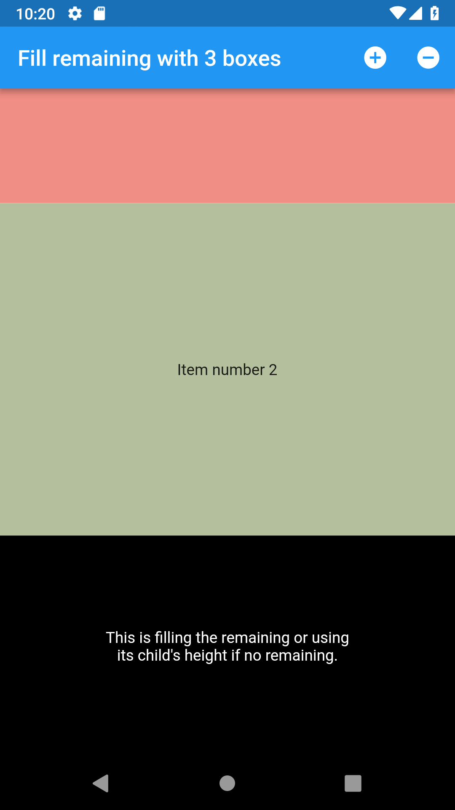
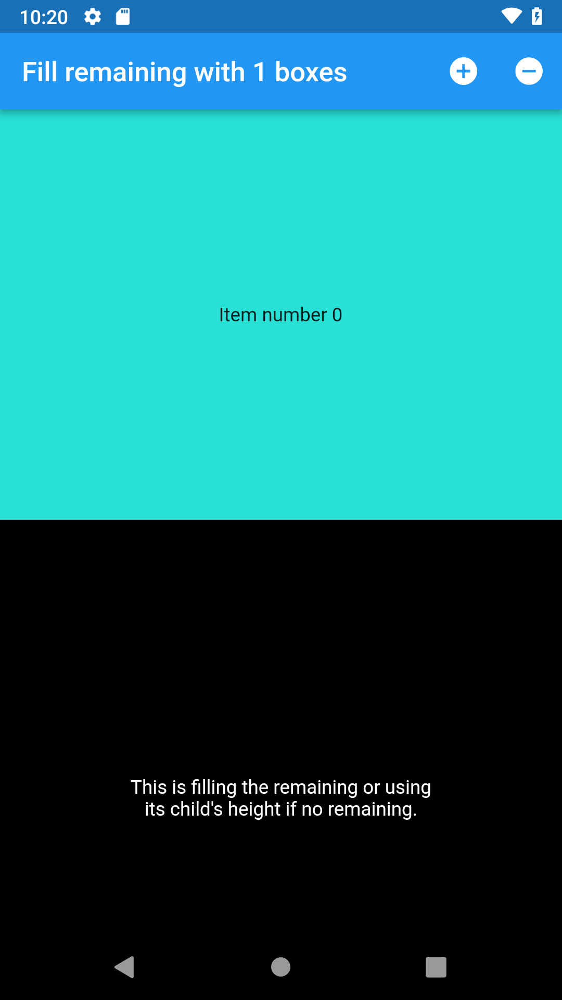
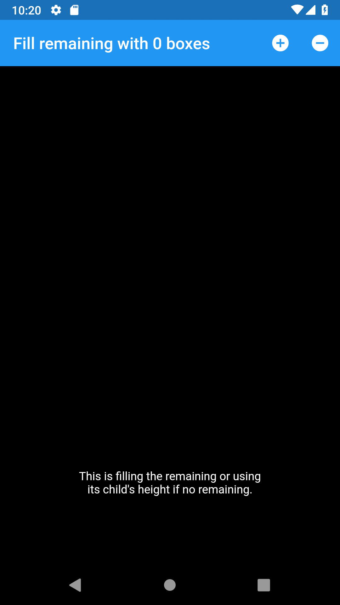

# Sliver Fill Remaining Box Adapter

![pub package][version_badge]

A flutter package providng SliverFillRemainingBoxAdapter, a sliver that fills the remaining space 
or shows its child, whichever is larger.

This is essentially a combination of SliverFillRemaining, which sizes its child to the remaining
space even if the child wants to be larger; and SliverToBoxAdapter, which is a sliver which sizes
itself to its child.

This looks something like this:

Size by Child  | Filling remaining a bit | Filling entire viewport
:----:|:-----:|:----:
 |  | 

## Usage

The SliverFillRemainingBoxAdapter can be used in a similar way to other slivers, particularly
SliverBoxAdapter. It hasn't been tested with ShrinkWrap set to true, and shouldn't be expected
to be have well in that scenario. It also hasn't been tested when it isn't the last item in
the list, or when there multiple SliverFillRemainingBoxAdapter instances.

If you have any problems please let me know by opening an issue! As this is just a side-project,
I can't promise to be very quick to respond but I'll do my best.

Anyone willing to make contributions are very welcome to submit PRs.

[version_badge]: https://img.shields.io/pub/v/sliver_fill_remaining_box_adapter.svg